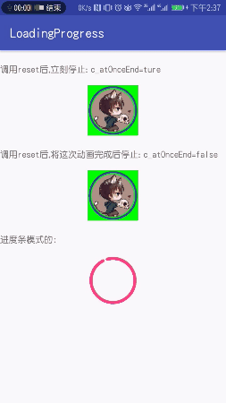

#### 仿微博点击头像加载动画

仿微博的头像动画

#### 预览图


#### 原理
整个效果分成两部分。一部分为弧度动画，一部分为点点动画

弧度动画就是画弧线，动画改变弧度就可以了

点点动画比较复杂。总共分为两步，1.计算非弧线的地方可以容纳的点点个数，然后画出来；2.根据弧度的改变确定点点的宽度

最后让整个旋转起来 OK


#### 使用

自定义的属性

```
c_progressColor : 进度条的颜色
c_strokeWidth : 进度条的宽度
c_autoRunning ：自动开始旋转
c_atOnceEnd ：true调用reset后立刻结束动画，false会等到动画执行完后结束
```


1.作为进度加载使用

```
    <com.cyy.progress.loading.LoadingProgress
        xmlns:app="http://schemas.android.com/apk/res-auto"
        android:layout_width="80dp"
        android:layout_height="80dp"
        android:layout_marginTop="16dp"
        app:c_progressColor="@color/colorAccent"
        app:c_strokeWidth="5dp" />

```

2.配合头像使用

layout文件

```
    <FrameLayout
        android:id="@+id/headerLayout"
        android:layout_width="80dp"
        android:layout_height="80dp"
        android:layout_marginTop="16dp"
        android:background="#00ff00">

        <com.cyy.progress.loading.LoadingProgress xmlns:app="http://schemas.android.com/apk/res-auto"
            android:id="@+id/loadingProgress"
            android:layout_width="match_parent"
            android:layout_height="match_parent"
            app:c_atOnceEnd="true"
            app:c_autoRunning="false"
            app:c_progressColor="@color/colorPrimaryDark"
            app:c_strokeWidth="3dp" />

        <view
            class="de.hdodenhof.circleimageview.CircleImageView"
            android:layout_width="match_parent"
            android:layout_height="match_parent"
            android:layout_margin="6dp"
            android:src="@mipmap/header" />

    </FrameLayout>

```

activity中代码中这是点击时点用start(), 这里模拟网络加载7s后调用reset

```
        headerLayout.setOnClickListener {
            loadingProgress.start()

            headerLayout.postDelayed({
                loadingProgress.reset()
            } , 7000)
        }
```

3.事件回调

```
    fun onProgressStartListener(progress: LoadingProgress) //开始旋转
    fun onProgressRepeatListener(progress: LoadingProgress) //每个周期结束的时候调用
    fun onProgressResetListener(progress: LoadingProgress) //重置的回调事件
    fun onProgressEndListener(progress: LoadingProgress ) //动画结束回调
```

