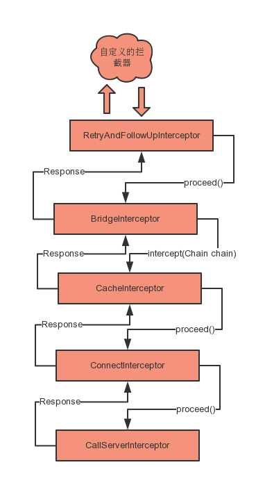

#### Okhttp拦截器原理

OkHttp几乎所有的和请求相关的动作都在几个拦截器中处理的，本质上来说其实就是一个递归的方式调用所有的拦截器

原理大概想这个图一样



======
##### RealInterceptorChain

这个类是一个所有的拦截器的管理类，他负责调度所有的拦截器，主要的实现方法在

```
public Response proceed(Request request, StreamAllocation streamAllocation, HttpCodec httpCodec,
      RealConnection connection) throws IOException
```

比较重要的就这几行

```
    RealInterceptorChain next = new RealInterceptorChain(
        interceptors, streamAllocation, httpCodec, connection, index + 1, request);

    //   interceptors.get(index); 这个index是当前的拦截器的位置 ，上面的index+1是下一个拦截器
    Interceptor interceptor = interceptors.get(index);
    Response response = interceptor.intercept(next);

```

所有的拦截器继承Interceptor接口重写了intercept(Chain chain)这个方法，这个方法的chain就是这段代码构建的。
构建这个Chain必须需要 interceptors ， index ,其他的可以根据业务需求确定。
   * interceptors是所有的拦截器，
   * index 是下一个拦截器的位置
然后拿到当前index的Interceptor调用intercept()方法并将构建的chain传进去就可以了

在一个拦截器中的intercept()方法要求有两点：
    1.必须调用chain.proceed()将时间传下去
    2.chain.proceed()不能调用两次，否侧代码会重新再走一次，OkHttp对这个做了一个抛出异常处理

##### 我学到的东西
拦截器的这种编程思想很不错，非常适合一个任务需要很多手续处理一样。
[示例代码]()


